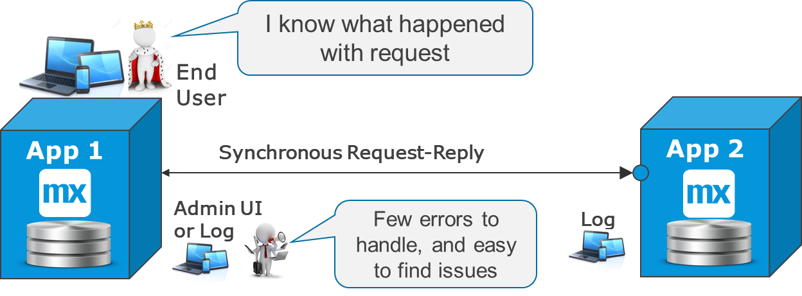
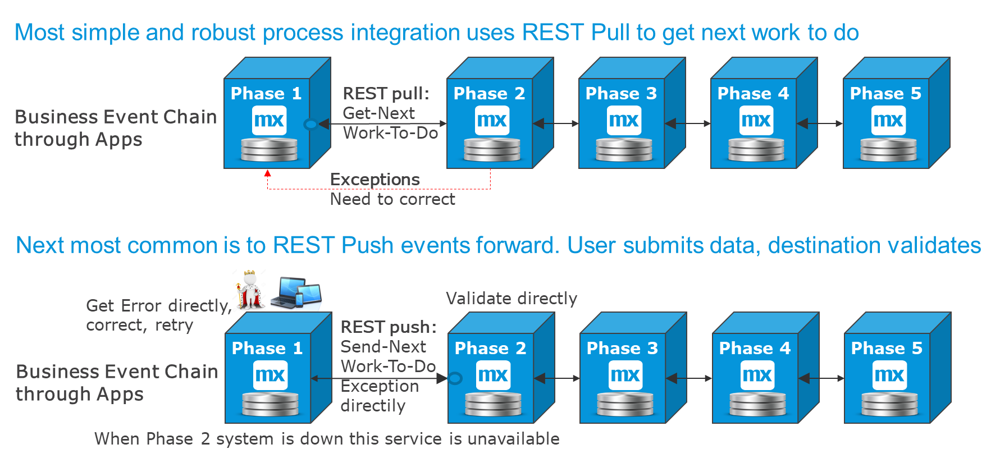
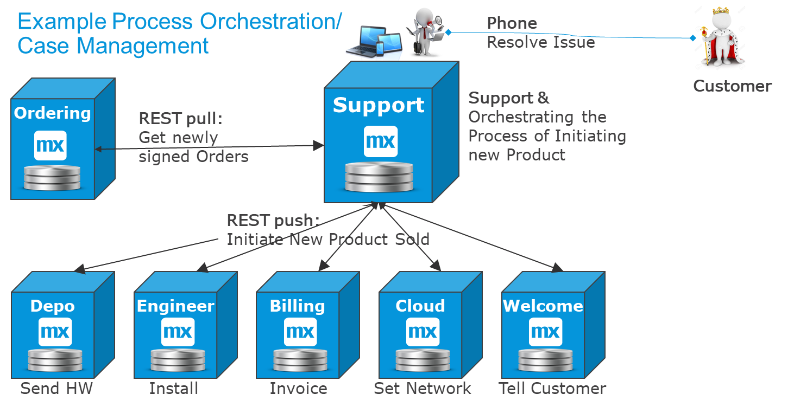
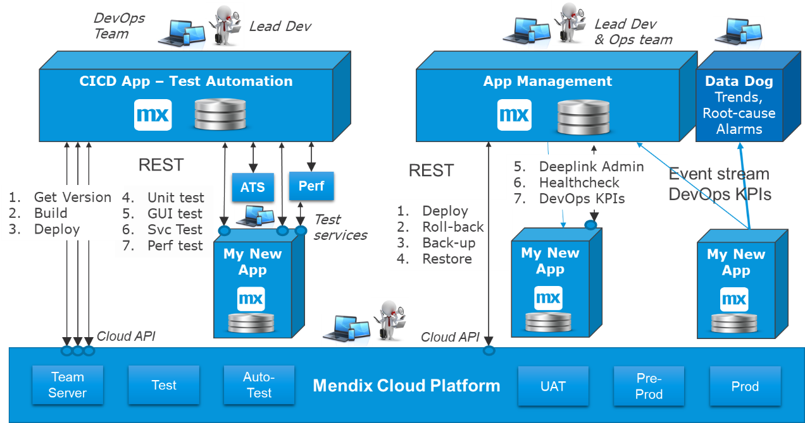

## 1 Introduction

It is easy to understand synchronous request-reply interfaces, because the service either works or it does not. Furthermore, the initiating process gets feedback instantly. This makes error handling easier, because the same system that initiates the call also gets information about the result and can take a relevant action.

To start with service integration, consider this scenario: a user is filling in an order or a form, and they need to be informed of things such as mistakes in their entries or that the product they requested is out of stock.

Service integration should first be considered as the default method for integration. Only if there are strong reasons to avoid synchronous request-reply, then UI integration, batch processing, or event processing should be considered.

## 2 What Is Service Integration?

Service-based integration (or remote procedure call (RPC) integration) is request-reply and almost always synchronous. It works like this:

1. One system initiates the call and waits for an answer. There should be a time-out configured.
2. The originating system will know the result of the call immediately:
	* A time-out if the destination system was unavailable
	* A success status if the operation succeeded
	* A set of data that was requested in the call
	* An error with information about why the call did not work

Synchronous calls can be used for almost anything as long as the other system is directly reachable through the network.

This diagram presents the main functional cases:

The main functional cases for Mendix apps can be described like this:

* Pulling for new data or events to process from the source app
* Initiating a function remotely and often receiving results back
* Pushing data forward to an app that validates and returns results

## 3 Synchronous Integration Styles

Service integration includes integration styles that are dominated by synchronous calls between two systems:

* Request-reply interfaces with REST and SOAP
* Database integration with OData and SQL
* Business events and process integration without using queues
* Integration apps and distributed enterprise service buses (ESBs)
* Process orchestration
* CI/CD and test automation orchestration

Synchronous integration styles are the most commonly used and easiest to manage, because there are no moving parts between the two systems.

## 4 Request-Reply to Transfer Data

For most standard interfaces, a request-reply scenario is the easiest way to integrate. That is because the side of the interface that starts the integration knows directly if the call worked or not.

If there is a time-out, it is possible to try later, if that is relevant. If it there is an error message, the calling system can react directly via the following methods:

* Setting a flag
* Starting an error workflow
* Showing an error message that helps the user correct the problem immediately

This diagram describes how within request-reply, there are three basic options to move data or an event from one app to the next:

The options for moving data can be described like this:

* Pulling data or a business event from another system
* Pushing data to another system or initiating a process there
* Using a service layer in between, such as API management

### 4.1 Pull Request-Reply Is Most Common for Replicating Data

The pull request-reply option is the most commonly used when replicating data from point A to point B.

The reason for this is that the system that needs the data is in charge of triggering the interface. To know what has changed, there are 3–4 options, explained in the section “Request-Reply Options”.

{}[**UNCLEAR WHAT SECTION/DOC IS BEING REFERENCED ABOVE**]{}

### 4.2 Push Request-Reply When Validation Is Needed

Pushing data to another system is useful when there is validation in the destination (for example, to change the master data). If there is a validation error, the user should see it directly while in the process of changing the data so that they can correct it immediately.

## 5 Database Integration & OData

Mendix can integrate directly with external databases using OSQL, OData, or SQL.

OData is the preferred method (if available), because it provides a clear contract and is directly supported from the Mendix Platform. However, both sides of the integration are required to support the OData. For example, the integration from Mendix to [SAP](/refguide/sap/sap-odata-connector) is well supported via OData contracts.

OData can be used between Mendix apps for reading out data directly and from BI solutions to retrieve data from a Mendix app closer to real-time than by using a daily batch file.

The reason for using OData could be that a good REST service is not available. You may also be working with an old legacy database where the data model never changes or changes very rarely, so that there is little risk for the calls to fail due to changes in the system below. For a Mendix app to get data, from a legacy application that should no longer be changed, it is unlikely that OData is available. Then, direct SQL is often used.

In all the cases where database integration is done, it is recommended to have some level or “padding” from the base database tables. This is so when things change in the source system, the integration still works. Conider these points:

* For read-contracts, a database view is recommended that provides a simplification of the SQL required in the Mendix Java action that calls it.
* For updating and creating objects in an external database, a stored database procedure is recommended that can do the necessary validation and perform the update in a consistent way (which the calling app should not be aware of)

This diagram shows the most common cases of OData integration and direct database integration:

{}
Never do direct SQL across firewalls.
{}

## 6 Integration Apps & Distributed ESBs

Many old legacy systems have a very specific format of communication, which could be from mainframes or any other old technology. To create good integration with these systems takes a technical developer.

To build this technical integration repeatedly is not a good idea. There is the option to create one single adapter or integration app that specializes in the intricacies of that legacy system.

Other apps can then integrate with the adapter in a simple format using, for example, REST or files and pre-configured functionality. As an example scenario, it could take 3 TCP/IP RPC calls to do an operation, which the integration app encapsulates into one single easy-to-use REST service.

Depending on the case, the integration app may only forward real-time requests to the back-end system, cache some requests, or even store entire datasets and provide them via services or files. It really depends on the following questions:

* What is the legacy system capable of?
* What is the requirement to use the data from other systems?

In the diagram below, both file and RPC integration is shown to the legacy system. Depending on the situation one can use one method or both.

For example, imagine that most of the interaction is the retrieval of data. To make that fast and easy, the integration app imports the relevant data via a file and stores it in a format that is ideal for retrieval with a materialized view that makes parts of the legacy system data easily available via OData. For the updates, you need them to be synchronous all the way, so you use REST into the integration app. That will translate to TCP/IP and update the legacy system as a request-reply interface, informing the user of success or failure

The benefit of using Mendix in this type of scenario is that if there is an admin UI needed, it is easy to provide. In effect, with this pattern you can create a distributed ESB.

## 7 Business Events

When a business process runs across several systems, there will be some type of process integration. There are many ways this can be done:

* **Business events** – work finishes in one app (or thing) and the next app is notified to start the next steps of the process
* **State Engine/Event Manager** –  events related to processes are gathered in order to determine that they finish correctly, and action is taken when something is wrong
* **Process orchestration** – a system orchestrates a process across several systems, maybe with manual steps in-between to keep track of status
* **Case Management** – human workflow in phases maintains a “case” object with data and status; the case is routed to different user group baskets and/or sub-cases are created and completed in other systems
* **Workflow integration** – a user works in one app and then continues the same process in another app (using, for example, a deep-link)

The integration requirements for transactional data differ from the requirements for master data and reference data. Transactional data changes often and needs to be available for other systems quickly. In this diagram, the two most common options are displayed:

* **REST pull** – In this option, the phase-1 system finishes a piece of work and a flag is set or an internal event is created and stored internally. The phase-2 system then polls phase 1 to ask for new work. When it has correctly picked up a piece of work, phase 1 resets the flag.
* **REST push** – In this option, the phase-1 system pushes the event forward (which is a good idea when a human worked on the case).  The phase-2 system then needs to verify that the data is correct. By doing this synchronously, the user can correct data directly.

## 8 Process Orchestration & Case Management

In rare cases, a process will finish and several systems will need to be updated at the same time. This process will run over several systems, so you will need a place that knows what the current status is and what to do next.

This pattern was common with business process management (BPM) engines when many people tried to use BPM for almost all situations, which was not very valuable. It was eventually seen that most processes where humans are involved are not deterministic.

For this option, most work is done “when possible” in “phases” where certain pre-conditions are completed first. This leads to case-management systems, which can be quite valuable especially for support desks, where a top-level ticket can be sent around, or sub-tickets can be orchestrated that other teams and support desks take care of.

A problem with process-based work is that, depending on the sector and the type of work, there are different ways of interacting and working. The consequence is that it is often hard to fit real work onto specific BPM and case-management engines. 

Simple process engines and case-management systems can be easily created with Mendix apps. The advantage here is that you get only what you need, and the way of working can be adapted to the case at hand.

In the diagram below, a support app has been given the task of process orchestration for the operationalization of a newly sold product:

These are the reasons for this setup:

* The support app already deals with cases and the distribution of tasks
* If there is an issue, the customer is likely to call Support

## 9 Ops Integration & Test Services

A new trend (which is part of microservices and DevOps) is to build services from live systems that are specifically oriented towards automated testing and health checks on live systems. A service that is used to test things in CI/CD pipelines may later be reused to verify a production deployment, check a live system, or collect user metrics for a dashboard.

This diagram presents three typical parts covered via IT delivery automation, which is a very common form of process orchestration:

CI/CD & test automation is often done with Jenkins, GitHub CI, or AKS. However, there are Mendix customers that run on Mendix Cloud and do CI/CD with a Mendix app calling Mendix Cloud APIs while using test systems like [ATS](/ats/index) or specific test services. Typically, this chain is run nightly and gives a report each morning to the DevOps team on the issues found.

The new app in the diagram above has the [UnitTesting](https://appstore.home.mendix.com/link/app/390/) module installed and unit tests configured for key microflows. It also has specific test services that cover full functional scenarios and a health check that is used in production. Finally, the app has an admin page with collected technical and functional KPIs that help with maintaining the solution.

From the app management dashboard, you have an overview of everything that is needed as well as a deep link to the admin page for closer inspection when required. You can  make deployments possible here (if that is user-friendly) by calling the APIs of the Mendix Cloud (or, if on VPC, by calling Jenkins or Azure DevOps).

For professional operations solutions, there is often an agent per node that is shipping data in near-real time towards an application performance monitoring ([APM](https://docs.mendix.com/apm/)) system (such as Data Dog) that is used for root-cause analysis, trend analysis, sizing metrics, and alarms.
